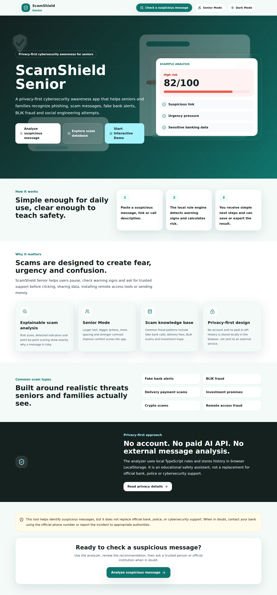
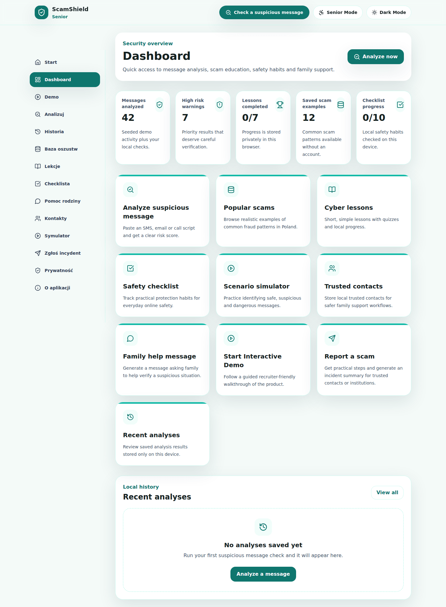
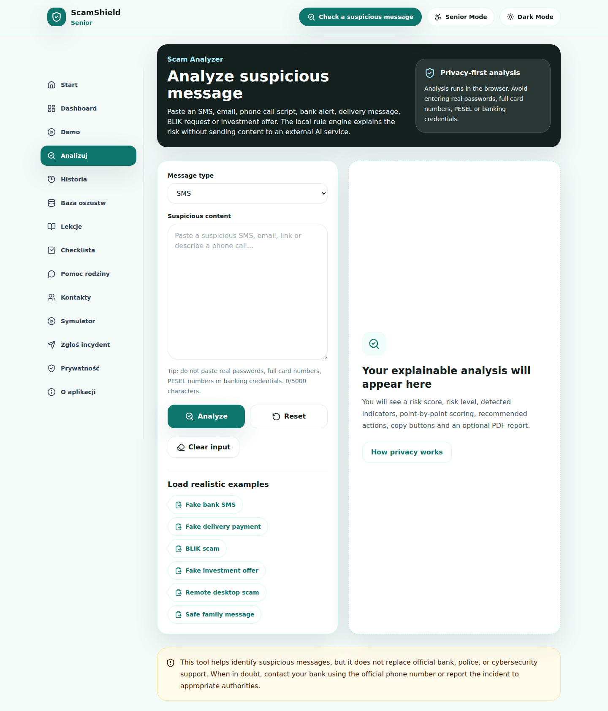
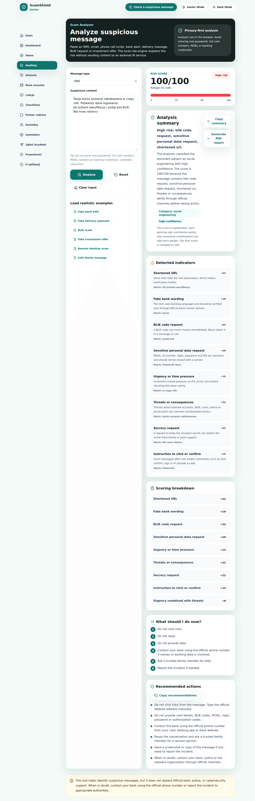
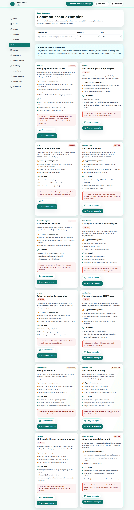
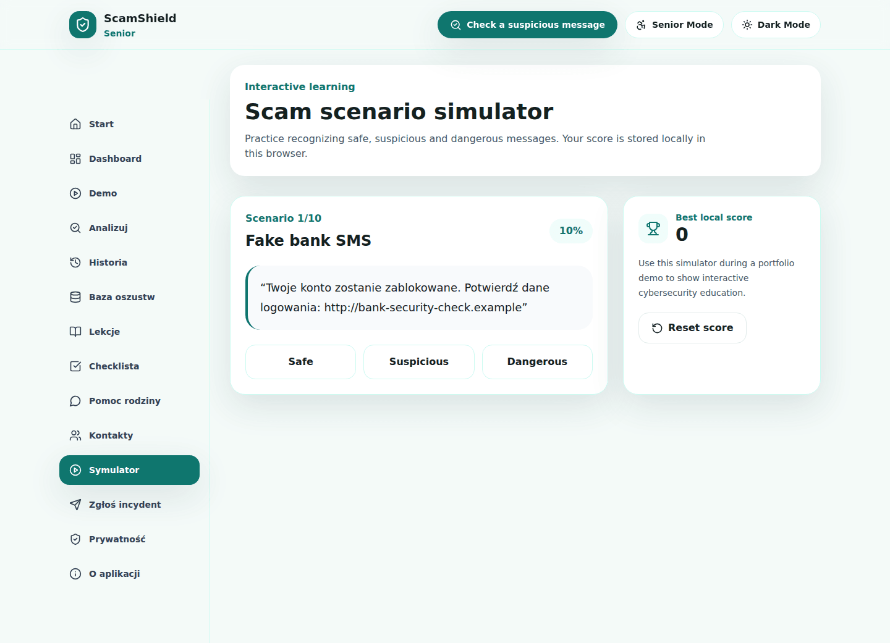
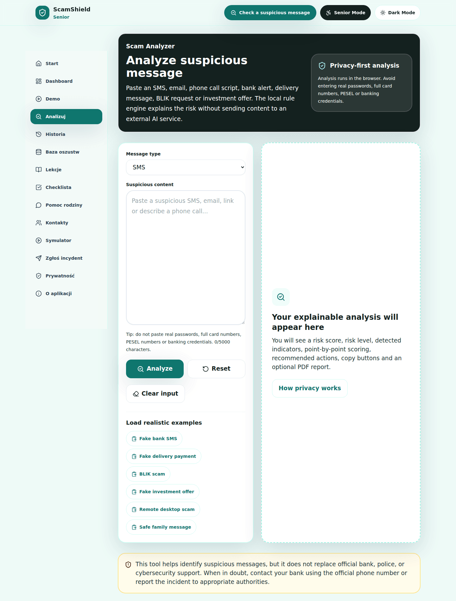
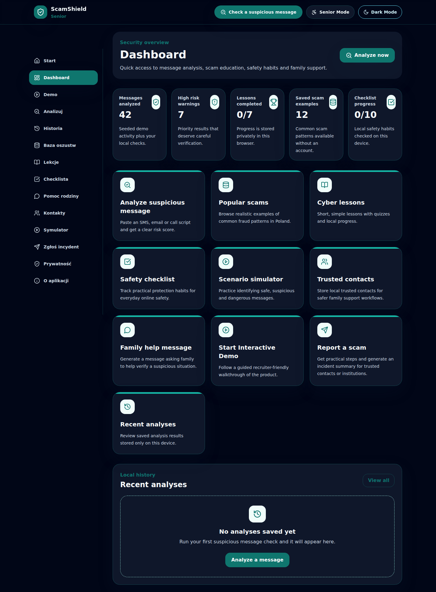

# ScamShield Senior


ScamShield Senior is a privacy-first cybersecurity awareness web app that helps seniors and families detect phishing, scam messages, fake bank alerts, BLIK fraud, delivery scams and social engineering attempts using an explainable rule-based risk analysis engine.

Live demo: _Add deployment link here._

## Screenshots

### Landing Page


### Dashboard


### Scam Analyzer


### Analysis Result


### Scam Database


### Scenario Simulator


### Senior Mode


### Dark Mode


## Features

- Modern landing page and product-style dashboard
- Explainable scam analyzer with 0-100 risk score
- Dominant scam category and confidence level
- Detected indicators with matched keywords and point values
- Scoring breakdown and “What should I do now?” action panel
- Input length limits and sensitive-number masking in previews
- PDF export and copy-to-clipboard actions
- Analysis history with risk filters
- Scam database with search, category filters, risk filters and analyze-example links
- Cyber lessons with quizzes and LocalStorage progress
- Safety checklist with persistent progress
- Family help message generator
- Trusted contacts stored locally in the browser
- Incident report guide and copyable incident summary
- Privacy & Security page
- Interactive demo route for recruiters
- Scenario simulator learning game
- Senior Mode and optional Dark Mode
- PWA manifest, icons and lightweight service worker
- Docker development setup
- GitHub Actions CI

## Tech Stack

- Next.js App Router
- React
- TypeScript
- Tailwind CSS
- LocalStorage
- lucide-react
- jsPDF
- Vitest
- Docker
- GitHub Actions

## Cybersecurity Focus

The analyzer detects patterns connected to:

- phishing links and shortened URLs
- fake bank messages
- fake delivery payments
- BLIK code requests
- card, PESEL, login and password requests
- urgency and social engineering pressure
- police, court, debt and blocked-account threats
- fake investment and crypto profit promises
- AnyDesk, TeamViewer and remote access fraud
- secrecy requests and unknown-sender stories

The score is explainable. The app shows which indicators were found, why they matter, how many points they add and what the user should do next.

## Privacy-First Approach

- No account required
- No backend in the MVP
- No paid AI API
- No message content sent to external analysis services
- LocalStorage persistence for history, contacts, lessons, checklist and settings
- Clear warnings not to enter real passwords, full card numbers, PESEL numbers or banking credentials
- LocalStorage limitations documented in [docs/SECURITY.md](docs/SECURITY.md)

## Accessibility

- Semantic headings and form labels
- Large click targets
- Visible focus states
- Keyboard-friendly controls
- Risk labels that do not rely only on color
- Senior Mode for larger text, spacing and contrast
- Reduced motion support
- Responsive layouts for mobile and desktop

## Run with Docker

```bash
docker compose up --build
```

Open:

```txt
http://localhost:3000
```

## Run Locally with npm

```bash
npm install
npm run dev
```

Quality checks:

```bash
npm run lint
npm test
npm run test:run
npm run build
npm audit
```

## Project Structure

```txt
app/
  analyze/
  dashboard/
  demo/
  family-help/
  history/
  privacy-security/
  report/
  scenario-simulator/
  scams/
  trusted-contacts/
components/
data/
docs/
hooks/
lib/
public/
tests/
```

## Architecture Notes

See [docs/ARCHITECTURE.md](docs/ARCHITECTURE.md).

Key decisions:

- rule-based engine instead of AI API for privacy and explainability
- LocalStorage instead of backend persistence for the MVP
- no authentication in the MVP
- Senior Mode and Dark Mode implemented as global UI settings
- Docker and GitHub Actions included for professional project hygiene

## Manual Smoke Tests

See [docs/SMOKE_TESTS.md](docs/SMOKE_TESTS.md).

## Screenshot Guide

See [docs/SCREENSHOTS.md](docs/SCREENSHOTS.md).

## Changelog

See [CHANGELOG.md](CHANGELOG.md).

## GitHub Topics

```txt
cybersecurity
phishing
scam-detection
nextjs
typescript
react
tailwindcss
security-awareness
senior-friendly
accessibility
social-engineering
portfolio-project
pwa
docker
```

## Future Improvements

- Real AI/NLP integration for more advanced scam detection
- Browser extension for checking suspicious websites
- SMS import and mobile app version
- Family account system with secure sync
- Admin panel for managing scam examples
- Real-time scam alerts
- CERT Polska / NASK feed integration
- PDF export improvements
- Multi-language support
- Voice assistant mode for seniors
- Offline PWA improvements
- Dark mode theme refinements
- Admin dashboard with scam statistics
- Report sharing with trusted contacts

## Portfolio Description

ScamShield Senior is a cybersecurity-focused web application created to help seniors and their families recognize phishing, scam messages, fake bank alerts, BLIK fraud, delivery scams and social engineering attempts.

The application includes a rule-based risk analysis engine that calculates a risk score from 0 to 100, detects warning signs, explains threats in simple language and suggests safe next steps. It also contains a scam database, cybersecurity lessons, safety checklist, analysis history, family help message generator, incident reporting guidance, privacy and security page, trusted contacts, scenario simulator, PWA support and a senior-friendly interface mode.

## Disclaimer

This tool helps identify suspicious messages, but it does not replace official bank, police or cybersecurity support. When in doubt, contact your bank using the official phone number or report the incident to appropriate authorities.
